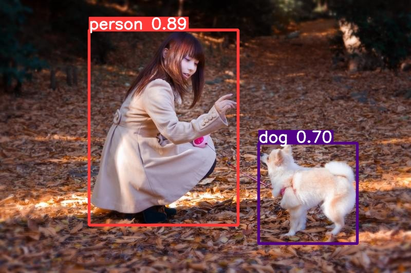

# yolo strongsort object tracking
yoloの学習済みモデルと、strongsortの学習済みモデルを用いて物体追跡を行う。  

[StrongSORT_YOLO](https://github.com/bharath5673/StrongSORT-YOLO)  
commit番号は7a55fe84cad84d1313339bceddfd3d8248c49130を利用する。  
```
$ git checkout 7a55fe84cad84d1313339bceddfd3d8248c49130
```

#### note
- numpyは1.23.5だと成功。それ以上だと、floatをfloat32などに変えろというエラーになる。  

## できること
### 1. 1枚の画像をyoloを使って物体検出

```
$ cd shell
$ sh image_predict.sh
```

image_predict.shの`--source`に予測したい画像を指定する。  

#### 入力画像
  

#### 出力画像
  

#### 出力ラベル
test_prdict/labels/test_01.txtに検出結果が出力される。  
```
# ラベルNo, x_center, y_center, width, height (全て割合)
16 0.74875 0.707317 0.24 0.36773
0 0.3975 0.466229 0.3625 0.714822
```

学習済みのyolov5を用いた物体検出ができる。  

### 2. 動画をstrongsortを使って物体追跡

```
$ sh movie_predict_yolov5.sh
# --yolo-weights: yolov5の学習済みモデルのパス
# --strong-sort-weights: strongsortの学習済みモデルのパス
# --config-strongsort: strongsortのconfigファイルのパス StrongSORT_YOLOの下のconfigファイルを指定
# --project: 出力パス
# --name: 出力ディレクトリ名 (prohect/name/配下に出力されることになる)
```

モデルは以下のコマンドでダウンロード
```
wget -c https://github.com/ultralytics/yolov5/releases/download/v7.0/yolov5x.pt \
      -O ./weights/yolov5x.pt
```

#### 入力動画
<div><video controls src="https://github.com/ys201810/yolo_strongsort/assets/43543590/30891f45-da40-40db-bf08-edd4db5923fb" muted="false"></video></div>

#### 出力動画
<div><video controls src="https://github.com/ys201810/yolo_strongsort/assets/43543590/c845c830-3339-4470-8d80-96df3d807154" muted="false"></video></div>

### 3. クラウドカウンティング用のモデル指定で物体追跡
```
poetry run python ../src/StrongSORT-YOLO/yolov5/detect.py \
  --source ../data/input_video/clip_video.mp4 \
  --yolo-weights weights/crowdhuman_yolov5m.pt \
  --strong-sort-weights osnet_x0_25_market1501.pt \
  --img 640 \
  --save-vid \
  --classes 0 \
  --exist-ok \
  --project ../data/output/ \
  --name crowdhuman_yolov5m_filter
```

モデルは以下のコマンドでダウンロード

```
gdown --id 1gglIwqxaH2iTvy6lZlXuAcMpd_U0GCUb \
       -O ./crowdhuman_yolov5m.pt
```

#### 出力動画
<div><video controls src="https://github.com/ys201810/yolo_strongsort/assets/43543590/423f0264-7663-485c-9029-c0aa2c0440de" muted="false"></video></div>
