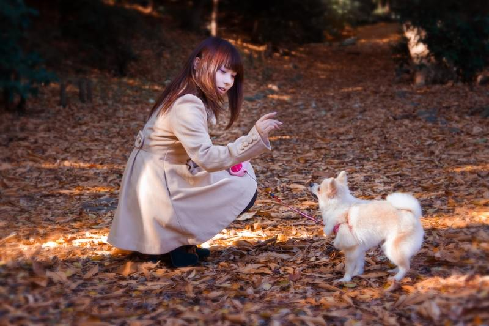

# yolo strongsort object tracking
yoloの学習済みモデルと、strongsortの学習済みモデルを用いて物体追跡を行う。  

[StrongSORT_YOLO](https://github.com/bharath5673/StrongSORT-YOLO)  
commit番号は7a55fe84cad84d1313339bceddfd3d8248c49130を利用する。  
```
$ git checkout 7a55fe84cad84d1313339bceddfd3d8248c49130
```

#### note
- numpyは1.23.5だと成功。それ以上だと、floatをfloat32などに変えろというエラーになる。  

## できること
### 1. 1枚の画像をyoloを使って物体検出

```
$ cd shell
$ sh image_predict.sh
```

image_predict.shの`--source`に予測したい画像を指定する。  

#### 入力画像
  

#### 出力画像
  

学習済みのyolov5を用いた物体検出ができる。  

### 2. 動画をstrongsortを使って物体追跡

```
$ sh movie_predict_yolov5.sh
# --yolo-weights: yolov5の学習済みモデルのパス
# --strong-sort-weights: strongsortの学習済みモデルのパス
# --config-strongsort: strongsortのconfigファイルのパス StrongSORT_YOLOの下のconfigファイルを指定
# --project: 出力パス
# --name: 出力ディレクトリ名 (prohect/name/配下に出力されることになる)
```
#### 入力動画
<div><video controls src="https://github.com/ys201810/yolo_strongsort/assets/43543590/30891f45-da40-40db-bf08-edd4db5923fb" muted="false"></video></div>

#### 出力動画
<div><video controls src="https://github.com/ys201810/yolo_strongsort/assets/43543590/c845c830-3339-4470-8d80-96df3d807154" muted="false"></video></div>


https://github.com/ys201810/yolo_strongsort/assets/43543590/c845c830-3339-4470-8d80-96df3d807154

